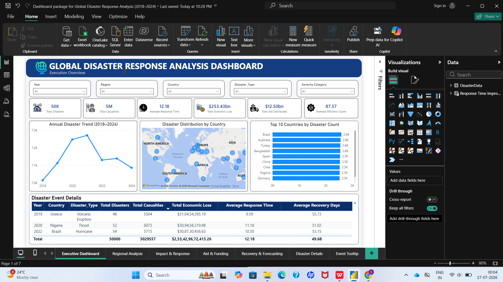
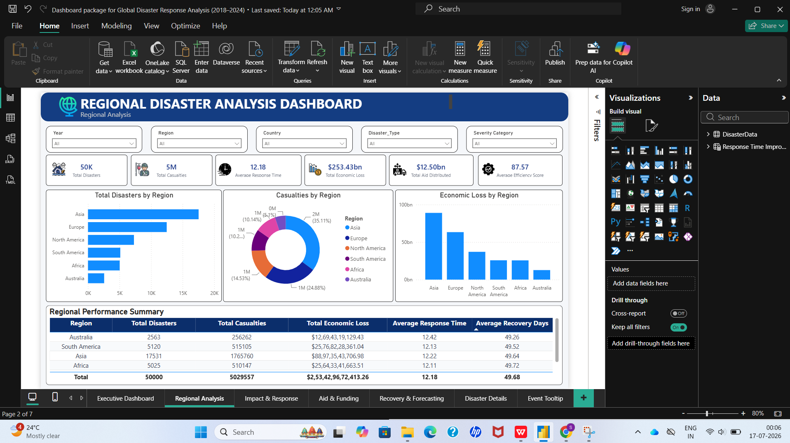
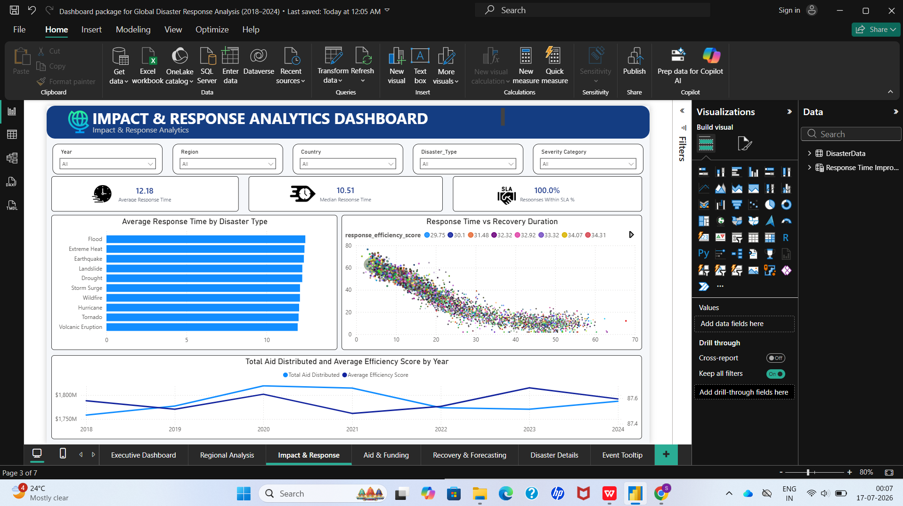
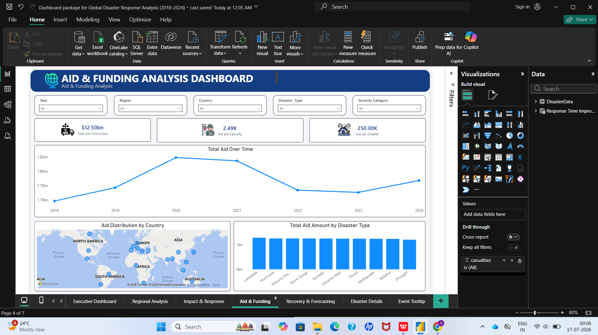
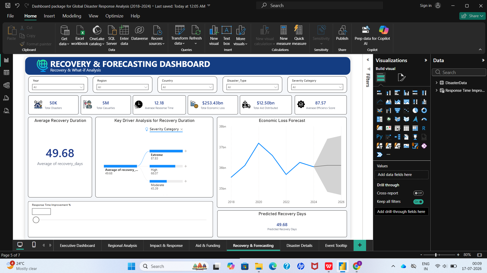
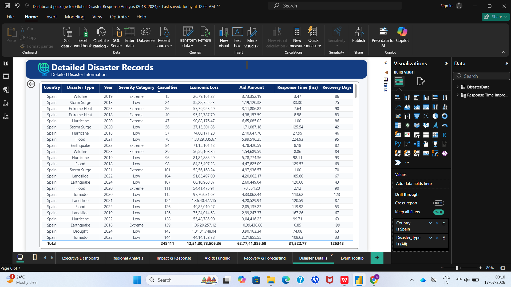
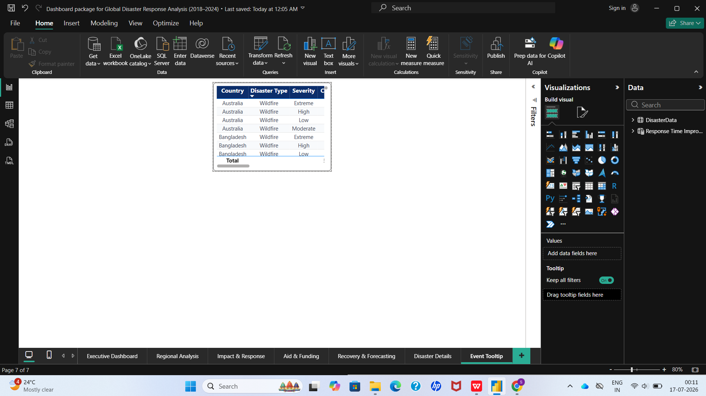

# 🌍 Global Disaster Response Analysis (2018–2024)

## 📌 Project Overview
This Power BI dashboard analyzes global disaster events from 2018–2024 to provide insights into disaster frequency, response performance, aid distribution, casualties, economic losses, and recovery trends. The dashboard helps organizations and decision-makers monitor disaster response efficiency and identify areas requiring immediate attention.

---

## 🎯 Objectives
- Analyze disaster trends across countries and regions.
- Monitor emergency response performance.
- Evaluate aid funding and resource distribution.
- Track casualties and economic losses.
- Forecast recovery trends for future planning.

---

## 📂 Project Structure

```
Global-Disaster-Response-Analysis
│
├── Dataset/
├── PowerBI/
├── Screenshots/
├── Documentation/
├── DAX/
├── docs/
├── src/
└── README.md
```

---

## 🛠 Tools & Technologies
- Power BI Desktop
- Microsoft Excel
- Power Query
- DAX (Data Analysis Expressions)

---

## 📊 Dashboard Features

- Executive Overview
- Regional Analysis
- Response Performance
- Aid Funding Analysis
- Recovery Forecasting
- Disaster Details
- Interactive Tooltip Page

---

## 📈 Key KPIs
- Total Disasters
- Total Casualties
- Total Economic Loss
- Average Response Time
- Total Aid Distributed
- Recovery Rate

---

## 📷 Dashboard Screenshots

| Dashboard | Preview |
|-----------|---------|
| Executive Overview |  |
| Regional Analysis |  |
| Response Performance |  |
| Aid Funding |  |
| Recovery Forecasting |  |
| Disaster Details |  |
| Tooltip Page |  |

---

## 📁 Files Included

- Dataset used for analysis
- Power BI Dashboard (.pbix)
- Dashboard Screenshots
- DAX Measures
- Project Documentation

---

## 🚀 Author

**Sanika Khamkar**

Aspiring Data Analyst | Power BI | SQL | Python | Excel
